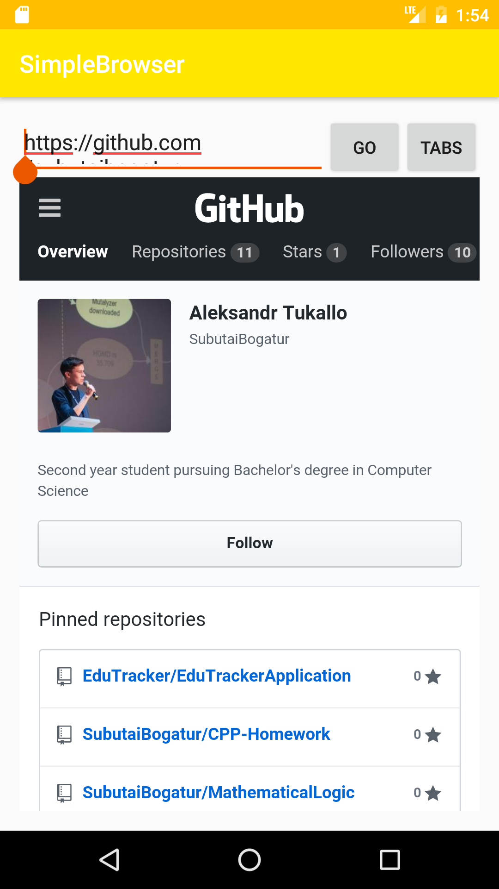

# SimpleBrowser
Android application implementing Simple Web Browser. 

Application allows to browse the Internet and manage multiple tabs, which can be switched, opened or closed. 
Browser supplies search suggestions using Yandex API, which are parsed from JSON. 

Implementation uses a pool of WebViews, that cache loaded web pages. WebViews are being effectively managed 
to reduce traffic usage and to speed up interaction with an interface.

